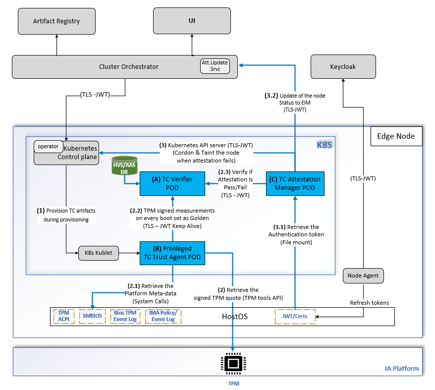
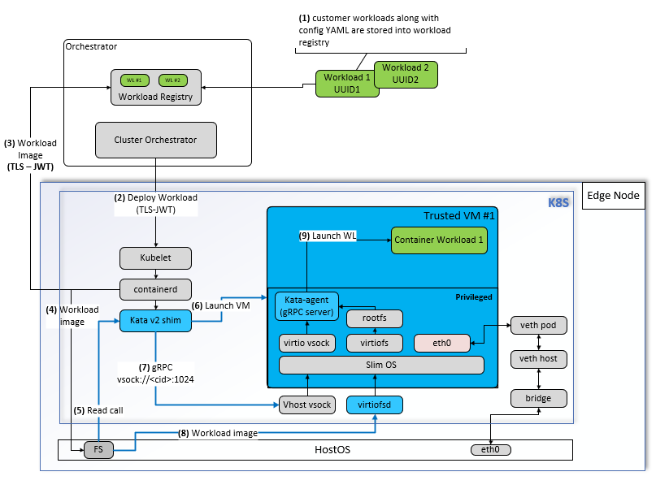

# Trusted Compute Architecture

Trusted Compute is a set of software-defined security extensions that utilize the hardware security
capabilities of a node.

A user can deploy the Trusted Compute standalone package on a node to achieve higher security
assurances for their workloads. These extensions enhance node protection through:

- **Continuous Monitoring**
- **Workload Protection through Isolated Execution**

This document provides a comprehensive view of the Trusted Compute extensions and an overview of the
key components that help you monitor the trust status of the nodes and protect workloads through
isolated execution.

## Objective

Trusted Compute enhances node protection through:

- **Continuous Monitoring:** Regularly checks the integrity of platform firmware, OS kernel, critical
  system components, and runtime environment through ongoing measurement and attestation.
- **Isolated Execution: Runs confidential workloads securely in a trusted VM environment,
  preventing unauthorized access or interference and safeguarding the host from the workloads.**
  - **Confidential workload:** A workload that handles sensitive or private data and requires
    protection from unauthorized access or tampering.
- **Security Objective: Trusted Compute ensures the integrity of code and data within container
  workloads running in a trusted VM instance**, protecting against attacks from unprivileged software,
  applications, and simple hardware adversaries. It prevents access to sensitive code and data during
  boot and runtime, detects tampering or unauthorized changes to platform software, and isolates the
  node from future workloads.

## Deployment

Trusted Compute is delivered as a standalone package that is installed directly on the node and
deploys its components as Helm-managed workloads in a Kubernetes\* cluster. The installer can either
provision a cluster on the node or deploy onto an existing standalone Kubernetes setup, and both
continuous monitoring and isolated execution are available in either case.

For installation steps, see the
[Trusted Compute Baremetal Installation Guide](trusted_compute_baremetal.md).

## Platform Prerequisites for Enabling Trusted Compute

- **Secure Boot:** For the Trusted Compute extensions to be deployed, Secure Boot must be enabled on
  the node.
- **Full Disk Encryption:** The platform must also enable full disk encryption.



*Figure 1: Continuous Monitoring*

## Continuous Integrity Monitoring Mechanism

Continuous monitoring involves three functional blocks, deployed in the `trusted-compute` namespace:

| Functional block | Pods |
| ---------------- | ---- |
| Trust Agent | `trustagent-suefi` (DaemonSet on the node) |
| Verifier | `aas`, `aasdb`, `cms`, `hvs`, `hvsdb` |
| Attestation Manager | `attestation-manager` |

### Trust Agent

The trusted boot process establishes a chain of trust from the firmware to the bootloader, kernel,
and userspace by measuring the integrity of each component. These measurements (hashes) are stored in
the TPM's platform configuration registers (PCR), ensuring the system's trustworthiness. The Trust
Agent on the node securely retrieves signed quotes of these measurements from the TPM for remote
comparison by the verifier against expected golden values (attestation).

### Verifier

The verifier comprises the following components:

- AAS (Authentication and Authorization Service) and its database
- CMS (Certificate Management Service)
- HVS (Host Verification Service) and its database

The scope of the verifier is to:

- Securely retrieve signed quotes from the Trust Agent pod for every attestation, verify them against
  the expected golden flavors, and publish the trust report.
- After every reboot of the node, set the first TPM measurements as golden flavors.

### Flavors

Flavor creation is the process of adding one or more sets of acceptable golden measurements to the
Verification Service database. These measurements correspond to specific system components and are
used as the basis of comparison to generate trust attestations. Flavors are automatically matched to
hosts based on the flavor group used by the host, the flavors, and the flavor match policies of the
flavor group.

### Trust Report Generated by the Verifier

The trust report is a JSON-formatted report that includes a chain of signatures providing auditability
for the report. The JSON attestation includes the base trust status of the host, as well as the
overall trust for each individual flavor used in the attestation. The report also contains host
information, such as TPM version, operating system name and version, BIOS version, and so on.

### Attestation Manager

The scope of the Attestation Manager pod is to:

- Set golden flavors with the verifier.
- Set the policy for attestation (cron job).
- Verify whether the attestation result is a pass or a fail.
- Verify the base dependency (platform metadata), such as Secure Boot being turned on, for every
  attestation report.
- Cordon the node by calling the Kubernetes\* API server API when an attestation fails.

### How Often Should an Attestation Be Run?

- Users can define a policy in Helm\* charts using the `pollDuration` field in the `values.yaml` file
  to specify how often the attestation should run. The default value is 60 minutes. Below is a
  snippet from `values.yaml`:

  ```yaml
  env:
    pollDuration: "60" # duration in minutes
  ```

- Every time a node platform reboots, the Trust Agent automatically initiates an attestation.

### What Happens When the Attestation Fails?

- The node can have one of the following statuses: **Verified**, **Attestation Failed**, or
  **Secure Boot Disabled**.
- **Attestation Failed or Secure Boot Disabled: When a node is in either of these states, the
  Attestation Manager places the node into a cordoned state.** This prevents the Kubernetes orchestrator
  from deploying any future applications to the affected node.
- **Resolution and Onboarding:** Once the source of the issue is identified and resolved, the node can
  undergo a fresh onboarding process to restore its functionality and status.

## Trusted Workload Protection

Trusted Compute allows orchestrating and executing a confidential workload within an isolated and
trusted VM on the node. The security objectives of this approach are:

- **Data confidentiality:** Unauthorized entities cannot view data while it is in use within the VM.
- **Data integrity:** Unauthorized entities cannot add, remove, or alter data while it is in use
  within the VM.
- **Code integrity:** Unauthorized entities cannot add, remove, or alter code executing in the VM.

The following sections describe the software architecture for protecting workloads using VM-based
isolated execution environments in a Kubernetes environment.

### Workload (App and Package) Prerequisites for Trusted Compute

1. **Build container image:** For applications and packages (workloads) that require higher levels of
   isolation, select the Kata runtime for container execution by setting the runtime class in the
   application's Helm chart or pod spec.
2. **Push to registry:** The user pushes the container image(s) to the workload registry. This is
   represented as **Step 1** in the diagram.



*Figure 2: Workload Protection*

### Deploying the Confidential Workload

1. **Deploy workload:** The user deploys the workload to the cluster. This is represented as
   **Step 2** in the diagram.
2. **Scheduling:** The workload is scheduled to target nodes that are Trusted Compute ready.
3. **Pull trusted VM image: The containerd runtime pulls the trusted VM image along with the
   workload and stores them on the node's file storage.** This is represented as **Steps 3 and 4** in
   the diagram.
4. **Launch trusted VM:** The trusted VM is launched and booted up. This is represented as **Step 5**
   in the diagram.

### Workload Execution Flow

1. **Bootstrap workload:** The Kata runtime shim communicates with the Kata agent within the trusted
   VM to bootstrap the workload from the mount point. This is represented as **Steps 6, 7, and 8** in
   the diagram.
2. **Launch workload:** The Kata agent launches the workload with the necessary resources. This is
   represented as **Step 8** in the diagram.

## Documentation

- [Trusted Compute Baremetal Installation Guide](trusted_compute_baremetal.md)
- [GPU Enablement in Trusted Compute Environment](trusted_compute_gpu_enablement.md)
- [NPU Enablement in Trusted Compute Environment](trusted_compute_npu_enablement.md)
- [SR-IOV Enablement User Guide](sriov_enablement_user_guide.md)
